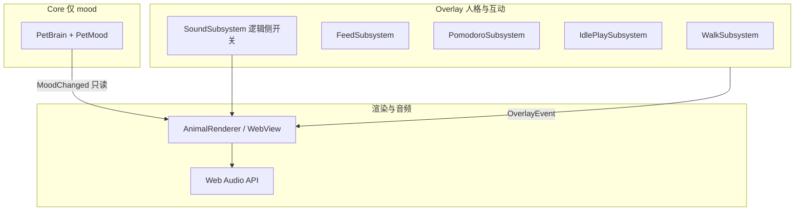

# 人格 / 互动层架构（遛猪、投喂、番茄钟、空闲自娱自乐、音效）

> **硬规则**：下列能力**一律**不新增 `PetMood` / 不污染 `PetBrain`。它们属于 **Overlay（人格与互动）** 或 **纯前端表现子系统**，与 Agent 业务状态（`Idle` / `AgentThinking` / …）正交。  
> 多动物扩展时：**共享同一套互动状态机与事件协议**，只替换 **AnimalRenderer**（猪 / 猫 / 兔等 SVG/CSS/音效映射）。

---

## 1. 分层总览

- **Core**：只回答「Agent / 会话在干什么」→ **一条** mood 时间线。  
- **Overlay**：回答「宠物在陪伴层面的行为」→ **多条并行子系统**，各自有状态机或调度器，**可叠加**在任意 mood 上（受下文「优先级」约束）。  
- **音效**：逻辑上属于 Overlay；**合成与播放**在 WebView（零资源包），Rust 侧只负责**开关与触发事件**（可选）。

---

## 2. 五类功能：各自归属（均非 PetState）

| 功能 | 子系统 | 状态放哪 | 是否进 `PetMood` | 持久化（建议） |
|------|--------|----------|------------------|----------------|
| **遛猪** | `WalkSubsystem` | 主进程：鼠标/窗口/开关 | 否 | `overlay.json`：`walk_enabled` |
| **投喂** | `FeedSubsystem` | 冷却、次数 | 否 | `overlay.json`：`last_feed_at_ms` 等（已有） |
| **番茄钟** | `PomodoroSubsystem` | 倒计时、阶段 | 否 | `overlay.json`：`pomodoro` 段（开始时间、剩余秒、阶段） |
| **空闲自娱自乐** | `IdlePlaySubsystem` | 调度下一次动画 id、冷却 | 否 | 可选：`idle_play` 偏好；或纯内存 |
| **音效** | `SoundSubsystem` + 前端合成 | 全局静音、分类开关 | 否 | `overlay.json` 或 `localStorage`：`sound_enabled` |

**命名约定**：子系统状态类型用 `*Phase` / `*State`，**禁止** `PetMood::*` 扩展。

---

## 3. 与 Core 的关系（何时允许、何时打断）

### 3.1 通用原则

- **不修改** `PetBrain` 的输入；Hook 只驱动 mood。  
- 互动层**可读**当前 `PetMood`（及 `pet` 的 `mood-*` class），用于：
  - **门控**：例如「空闲自娱自乐」仅在 `Idle` / `Sleeping` 时调度；  
  - **视觉**：番茄徽章与 mood 同屏叠加。  
- **Hook 优先**：任何 Agent 相关 mood 从 `busy` 变回时，**可打断** idle 动画、遛猪跟随（策略见各节）。

### 3.2 优先级（建议，实现时可微调）

从高到低（高者生效或覆盖低者的**可交互性**）：

1. **系统级**：拖拽窗口、隐藏、退出。  
2. **Agent 强反馈**：庆祝分档、Error/Success 短时表现（已有 Overlay）。  
3. **番茄钟**：进行中时**仍可**显示 mood；若与「全屏式」动画冲突，以**徽章 + 轻提示**为主，避免挡主状态。  
4. **遛猪**：开启时跟随鼠标；若与番茄钟/菜单冲突，以**菜单关闭**、**用户停止遛猪**为准。  
5. **投喂**：单次动画叠加，不打断 mood。  
6. **空闲自娱自乐**：仅 `Idle`/`Sleeping`；**任意**新 hook 或 `busy` mood 时**立即取消**当前 idle 动画。  
7. **音效**：与以上事件**订阅式**绑定，不反向改状态。

---

## 4. 各功能架构要点

### 4.1 遛猪（Walk）

- **状态机**（已有雏形）：`WalkPhase`：`Off` → `Idle` → `HoverIntent` → `Following` → …（结束/关闭）。  
- **Rust**：全局鼠标/窗口位置、用户开关；通过 `UserEvent` 或扩展 IPC 推 `WalkPhaseChanged`。  
- **前端**：`data-walk-phase`；仅 **AnimalRenderer** 决定「猪 vs 猫」的跟随步态/表情。  
- **非 PetState**：窗口跟随是 **窗口行为**，不是「Agent 在搜索」。

### 4.2 投喂（Feed）

- **状态**：冷却倒计时、`can_feed`；可选累计 `feed_count`（产品决定）。  
- **事件**：`FeedAvailabilityChanged`（已有）；投喂触发时发 **`FeedAnimation` 或一次性 `Overlay` 事件**（待实现）。  
- **非 PetState**：投喂是 **叠加动画**，不进入 `PetMood`。

### 4.3 番茄钟（Pomodoro）——下一迭代开发

- **状态机**：`Idle` / `Focus` / `ShortBreak` / `LongBreak`（或简化版 `Stopped` / `Running` / `Paused`）。  
- **计时源**：以 **Rust 单调时钟**或 **前端 `performance.now`** 二选一；推荐 **前端倒计时 + 定期与 Rust 对齐**（减少 IPC），或 **纯 Rust 写 overlay.json 剩余秒**（便于恢复）。  
- **UI**：`#pet` 上 **徽章节点**（DOM/HTML），与 mood SVG **兄弟节点**，不混入 `PetMood` 的 class。  
- **事件**：`PomodoroTick { remaining_sec: u32 }`、`PomodoroPhaseChanged { phase }`、`PomodoroCompleted`（完成时音效 + 气泡）。  
- **非 PetState**：专注态是 **用户行为**，与 Agent 无关。

### 4.4 空闲自娱自乐（Idle Play）——下一迭代开发

- **调度器**：仅在 `mood ∈ { Idle, Sleeping }` 且**无**遛猪跟随、**无**番茄钟全屏打断策略时，按 **随机间隔**（如 45–120s）触发一次 **动画 id**。  
- **动画 id**：`spin` / `hum` / `peek` / `nod` 等（字符串枚举）；**不**映射为 `PetMood`。  
- **打断**：`PetMood` 离开 `Idle`/`Sleeping` 或 `HookState` 变 fresh busy → 清除当前 idle 动画 class。  
- **事件**：`IdlePlayStarted { id }` / `IdlePlayEnded`（可选，便于音效与埋点）。  
- **实现落点**：**优先 WebView**（CSS + class），Rust 只发「允许/禁止 idle」或「强制结束」。

### 4.5 音效（Sound）

- **策略**：默认**静音**；用户显式开启后，对 **mood 切换、庆祝、番茄完成、投喂、idle 动画** 等发 **事件**或 **前端统一 `playCue(cue_id)`**。  
- **合成**：`Web Audio API`（与 CodePiggy 一致思路），**零外部音频文件**。  
- **非 PetState**：音效是 **反馈**，不是状态。

---

## 5. 事件与持久化（扩展 `OverlayEvent` / `overlay.json`）

- **OverlayEvent** 保持 **扁平** 或 `enum` 子模块，便于 `main` 里 `match` 到 `evaluate_script`。  
- **`~/.nixie/overlay.json`** 建议按 **版本字段** `schema_version` 演进，避免字段冲突。  
- **Fail-open**：缺字段 → 默认关 / 默认可投喂 / 番茄未运行。

---

## 6. 多动物（AnimalRenderer）

- **同一套**：`WalkPhase`、`PomodoroPhase`、`IdlePlayId`、`CelebrationTier`、音效 `cue_id`。  
- **不同套**：各动物的 SVG 结构、CSS 动画名、是否用同一 `data-*` 属性。  
- **切换动物**：仅替换 **HTML 片段或 CSS 变量**；**不** 重跑 `PetBrain`。

---

## 7. 落地顺序（与当前路线图一致）

1. **番茄钟** + **空闲自娱自乐**（下一迭代）：先实现 **PomodoroSubsystem + IdlePlaySubsystem** 的 **状态与事件**，再接 UI 与动效。  
2. **投喂 / 遛猪**：在现有 `Feed` / `Walk` 骨架上补全 IPC 与动画。  
3. **音效**：最后接 `playCue` 与开关持久化，避免早接导致事件遗漏。

---

## 8. 验收清单（架构层）

- [ ] 任意互动功能**不**增加 `PetMood` 变体。  
- [ ] `PetBrain`/`HookState` **不** 为番茄/遛猪/投喂 增加分支。  
- [ ] 文档与 `OverlayEvent` 命名一致，便于后续拆 `pet_overlay` 子模块。  

---

*本文档为架构约束；具体阈值、动画列表以产品迭代为准。*
